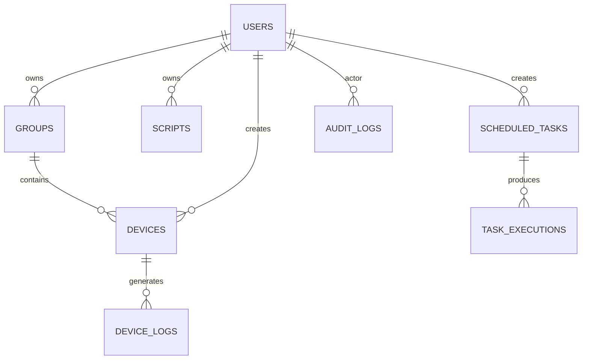

# 云手机平台 · 任务看板

> 技术栈：**React + Flask + Docker**（对应组长任务：项目初始化与技术选型 / 数据库架构设计 / 用户认证与权限系统 JWT+RBAC）

一个 X86 云手机群控平台的**任务看板**子系统：登录 Web 控制台 → 批量创建云手机 → 看板监控设备/任务指标 → 定时任务批量下发指令。设备编排层用 **simulator（纯内存 Mock）**，因此**免 Docker、免 Android 也能本地直接跑通**；接真机时只需在 `app/orchestrator.py` 补 redroid 的 Docker/ADB 调用。

---

## 一、技术选型（任务块 1）

| 层 | 选型 | 说明 |
|---|---|---|
| 前端 | **React 18 + Vite + react-router-dom + axios** | 自写轻量 CSS，零 UI 库依赖，npm install 极快 |
| 后端 | **Flask 3 + Flask-SQLAlchemy + Flask-CORS** | 工厂模式 `create_app`，蓝图拆分路由 |
| 数据库 | **PostgreSQL 15**（生产）/ **SQLite**（开发回退） | 同一套 SQLAlchemy 模型，换连接串即可 |
| 认证 | **PyJWT(HS256) + pbkdf2 密码哈希** | 自实现，逻辑透明，便于讲解 |
| 调度 | **APScheduler** 后台线程 | 每 5s 扫描到期任务执行 |
| 容器 | **Docker Compose** | postgres + redis + backend + frontend(nginx) 四件套 |

依赖管理：后端 `requirements.txt`，前端 `package.json`（pnpm/npm 均可）。

---

## 二、系统架构

```
┌─────────────┐    ┌──────────────┐    ┌────────────────────────────┐
│  React SPA  │───▶│  nginx :5173 │──▶│  Flask API :8000            │
│ (Vite dev)  │    │  /api 反代    │    │  auth/users/devices/tasks/  │
└─────────────┘    └──────────────┘    │  dashboard/audit 蓝图        │
                                        └───────────┬────────────────┘
                                                    │ SQLAlchemy
                                    ┌───────────────┼───────────────┐
                                    ▼               ▼               ▼
                              PostgreSQL 15     Redis 7        APScheduler
                              (主库)           (预留队列)      (定时任务)
```

实时/批量推送预留 WebSocket（本脚手架用轮询实现看板刷新，生产可换 SocketIO）。

---

## 三、数据库架构设计（任务块 2，8 张表）



| 表 | 核心字段 | 作用 |
|---|---|---|
| `users` | id, username, hashed_password, role, is_active | 用户 + RBAC 角色 |
| `groups` | id, name, owner_id | 设备分组 |
| `devices` | id, name, group_id, status, serial, backend, ip, fingerprint | 云手机设备 |
| `device_logs` | id, device_id, level, message | 设备日志 |
| `scheduled_tasks` | id, name, action, params(JSON), device_ids(JSON), schedule_type, next_run, enabled | 定时任务 |
| `task_executions` | id, task_id, status, total, ok, failed, detail | 执行记录 |
| `audit_logs` | id, actor_id, action, target_type, target_id, detail(JSON) | 操作审计 |
| `scripts` | id, name, steps(JSON), owner_id | 脚本模板 |

建表：`create_app()` 内 `db.create_all()` 自动建；生产建议换 Alembic 迁移。

---

## 四、用户认证与权限（任务块 3：JWT + RBAC）

### 4.1 登录链路
1. `POST /api/auth/login` → 校验 pbkdf2 密码 → 返回 `access_token`(HS256, 12h) + user。
2. 前端存 `localStorage.token`，axios 拦截器每个请求带 `Authorization: Bearer <token>`。
3. `GET /api/auth/me` 拉当前用户；**401 自动清 token 并跳登录页**（拦截器同步清状态，避免路由守卫卡死）。

### 4.2 密码安全
- `hash_password`：`pbkdf2_hmac("sha256", pwd, 随机16字节salt, 20万轮)`，存 `pbkdf2_sha256$轮数$salt$dk`。
- 校验用 `hmac.compare_digest` 防时序攻击。**不存明文、不用弱 md5**。

### 4.3 RBAC 四级角色
```
viewer(1) < operator(2) < admin(3) < superadmin(4)
```
- `require_role(min_role)` 装饰器：权限不足直接 **403**。
- 路由保护示例：
  - 设备/任务写操作 → `require_role("operator")`
  - 用户管理 / 审计查看 → `require_role("admin")`
- **细粒度边界**（作业加分项）：
  - `admin` 不能创建/分配 `admin` 及以上角色（仅 `superadmin` 能）；
  - 不能删除/降级**最后一个 superadmin**；
  - 不能改自己角色、不能删自己账号；
  - 密码强制复杂度（≥6 位且含字母+数字）。

### 4.4 操作审计
每次增删改用户/设备/任务都 `record_audit()` 写 `audit_logs`（谁、做了什么、对谁、细节 JSON）。

### 4.5 初始管理员
首次启动 `seed()` 幂等创建 `admin/Admin@123456` 与 `root/Root@123456` + 默认分组。

---

## 五、任务看板（看板模块）

- **数据看板**：`GET /api/metrics/overview` 返回 KPI（设备总数/运行中/异常/分组/任务）、状态分布、分组分布、最近设备、最近执行；前端**每 5 秒轮询刷新**。
- **任务调度**：`scheduled_tasks` + `scheduler_loop`（APScheduler 每 5s 扫到期任务）→ 先重排下次执行时间再执行 → 写 `task_executions`；支持 `once` / `interval`。
- **批量指令**：`open_url/tap/swipe/text/key/install/sequence/wait`。

---

## 六、本地运行

### 方式 A：免 Docker（推荐先跑通）
```bash
# 后端
cd backend
python -m venv .venv && .venv/Scripts/activate
pip install -r requirements.txt
cp .env.example .env
python run.py                 # http://localhost:8000

# 前端（另一个终端）
cd frontend
npm install
npm run dev                   # http://localhost:5173
```
默认账号：`admin / Admin@123456`。

### 方式 B：Docker 一键
```bash
docker compose up --build     # 前端 http://localhost:5173
```

---

## 七、目录结构
```
cloud-phone-board/
├── backend/
│   ├── app/
│   │   ├── __init__.py        # 工厂 create_app
│   │   ├── config.py          # 配置（JWT_SECRET / DB / RBAC 种子）
│   │   ├── extensions.py      # db / cors
│   │   ├── models.py          # 8 张表 ORM
│   │   ├── auth.py            # pbkdf2 + JWT + login_required/require_role
│   │   ├── seed.py            # 初始管理员
│   │   ├── scheduler.py       # APScheduler 调度
│   │   ├── orchestrator.py    # 设备编排(simulator/redroid)
│   │   └── routes/            # auth/users/devices/tasks/dashboard/audit/files/scripts/groups
│   ├── requirements.txt
│   ├── Dockerfile
│   └── run.py
├── frontend/
│   ├── src/
│   │   ├── api/client.js      # axios + JWT 拦截器
│   │   ├── store/auth.jsx     # 登录态 Context
│   │   ├── components/        # Layout / ProtectedRoute
│   │   └── views/             # Login/Register/Dashboard/Devices/Tasks/Users/Files/Scripts/Groups/Audit
│   ├── nginx.conf
│   ├── Dockerfile
│   └── package.json
├── docker-compose.yml
└── README.md
```

---

## 九、组长任务书 ↔ 实现进度（石文盛名下 11 项）

> 任务书共 21 条，下面仅列出**石文盛**负责的 11 项（彭旨豪的设备控制/真机/部署等部分不在本范围，已由 simulator 占位支撑演示）。

| # | 任务 | 类型 | 优先级 | 实现位置 | 状态 |
|---|------|------|--------|----------|------|
| 1 | 项目初始化与技术选型（React+Flask+Docker） | 设计 | P0 | `docker-compose.yml` + 两份 `Dockerfile` + `vite.config.js` 代理 | ✅ |
| 2 | 数据库架构设计 | 设计 | P0 | `backend/app/models.py`（8 张表 + `files` 表） | ✅ |
| 3 | 用户认证与权限系统（JWT登录+RBAC角色） | 功能 | P0 | `auth.py` + `seed.py` + `routes/users.py` + 审计 | ✅ |
| 13 | 登录/注册页面（表单验证+记住密码+token管理） | 功能 | P0 | `views/Login.jsx` + `views/Register.jsx` + `routes/auth.py#register` | ✅ |
| 15 | 用户管理页面（用户列表+角色分配+启用禁用） | 功能 | P1 | `views/Users.jsx` + `routes/users.py` | ✅ |
| 8 | 文件管理模块（上传/下载/浏览/推送设备） | 功能 | P1 | `routes/files.py` + `views/Files.jsx` + `FileRecord` 模型 | ✅ |
| 9 | 脚本管理模块（创建+编辑+执行+定时+模板+调度） | 功能 | P2 | `routes/scripts.py` + `views/Scripts.jsx` + 内置模板 | ✅ |
| 10 | 分组管理模块（分组+分组权限+批量操作） | 功能 | P2 | `routes/groups.py` + `views/Groups.jsx` | ✅ |
| 11 | 审计日志系统（全操作记录+高频操作过滤） | 功能 | P1 | `routes/audit.py`(过滤+stats) + `views/Audit.jsx` | ✅ |
| 17 | Docker容器化部署+云手机创建（共享） | 部署 | P0 | `docker-compose.yml`（postgres+redis+backend+frontend） | ✅ |
| 20 | GitHub代码推送（仓库初始化+.gitignore+提交） | 其他 | P1 | 本地已 `git init` + `.gitignore` 已优化 + 已提交 | ✅ |

**彭旨豪名下（非本范围，simulator 占位支撑演示）**：设备管理CRUD/Redroid后端/设备远程控制/ws-scrcpy投屏/全局布局/按时段分轮次/服务器部署/全功能测试/一键启动脚本/告警系统。本脚手架的设备管理、看板、Dashboard 已用 simulator 实现，足以演示「任务看板」主题。

### 9.1 各模块接口速查
- 注册：`POST /api/auth/register`（默认 viewer，返回 token 自动登录）
- 文件：`POST /api/files/upload`(operator) · `GET /api/files` · `GET /api/files/<id>/download` · `DELETE /api/files/<id>` · `POST /api/files/<id>/push`
- 脚本：`GET /api/scripts/templates` · `GET/POST /api/scripts` · `GET/PATCH/DELETE /api/scripts/<id>` · `POST /api/scripts/<id>/execute`
- 分组：`GET /api/groups` · `POST /api/groups`(admin) · `PATCH/DELETE /api/groups/<id>` · `POST /api/groups/<id>/batch-action`(operator)
- 审计：`GET /api/audit`(过滤: actor_id/action/target_type/start/end/limit) · `GET /api/audit/stats`(高频操作 Top)

### 9.2 提交到远程仓库（交差用）
本地已提交，推送只需补远程地址（替换 `<your-repo-url>`）：
```bash
git remote add origin <your-repo-url>
git branch -M main
git push -u origin main
```


---

## 八、生产注意事项
- `JWT_SECRET` / `SECRET_KEY` 必须换成强随机值，切勿用默认值。
- `CORS_ORIGINS` 写死前端域名，不要用 `*`。
- 数据库用 Alembic 做迁移，不要依赖 `create_all()`。
- 接真机时实现 `orchestrator.py` 的 redroid 分支（Docker SDK + adb）。
- 看板刷新可升级为 WebSocket(SocketIO) 推送，替代轮询。
